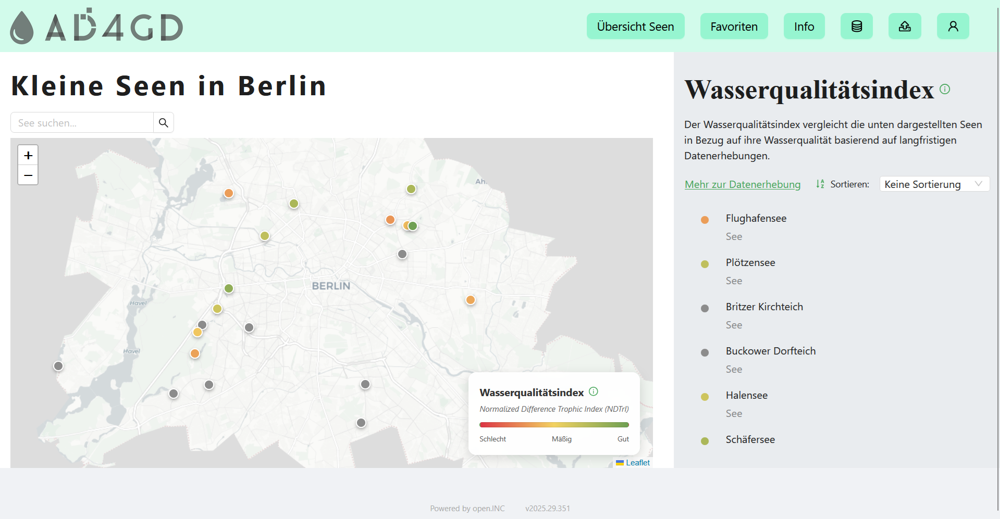
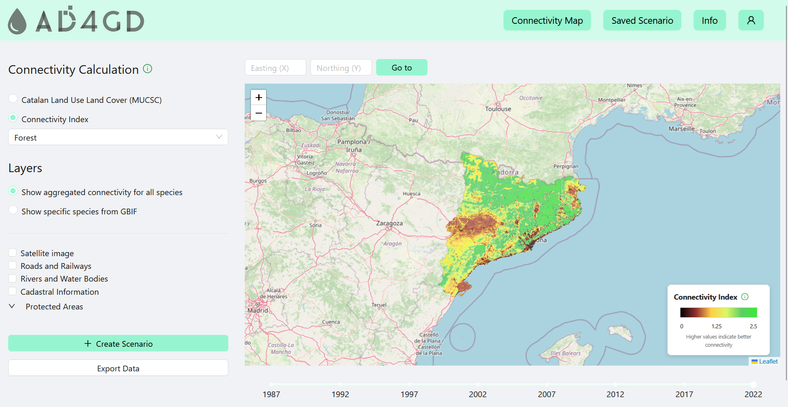

# AD4GD Graphical User Interface

## About

The AD4GD (All Data for Green Deal) Graphical User Interface component contains two separated web-based applications: The Splashboard (Pilot 1) and the BioConnect Tool (Pilot 2). The Splashboard provides users with a flexible interface for data visualization of the lakes from Berlin. The BioConnect Tool offers a user-friendly interface for the BioConnect platform, which monitors the habitat connectivity for the Catalonia region in Spain.

Visit our project [Splashboard](https://ad4gd.fit.fraunhofer.de/splashboard)  
Visit our project [BioConnect Tool](https://ad4gd.fit.fraunhofer.de/bioconnect)

<p align="center">
  <figure>
    
    <figcaption><em>Figure 1: The Splashboard</em></figcaption>
  </figure>
</p>

<p align="center">
  <figure>
    
    <figcaption><em>Figure 2: The BioConnect Tool</em></figcaption>
  </figure>
</p>

## Getting Started

### User Access

To use the application:

1. Visit https://ad4gd.fit.fraunhofer.de
2. Create an account or log in with existing credentials (You can just log in without email verification)
3. Access the application you want to use (Splashboard or BioConnect Tool)

### Development Setup

#### Prerequisites

You will need:

- Node.js (^18)
- npm (>=7)
- pnpm (^8)

Verify your installation:

```bash
node --version
npm --version
npm i -g pnpm
```

#### Installation

Install dependencies:

```bash
pnpm i
```

#### Development Server

Start the development server (port 8080):

```bash
pnpm start
```

#### Production Build

Create a production build:

```bash
pnpm run build
```

The build output will be in the `./dist` folder. When deploying:

- Copy the contents of `./dist` to your web server
- Configure the server to redirect 404s to `index.html` for client-side routing
